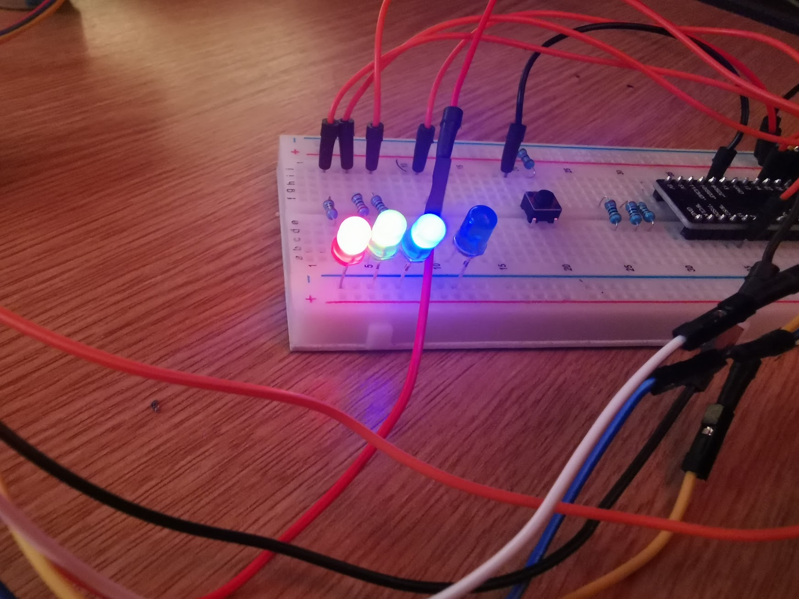

# MQTTBox

A simple ESP32-based device that subscribes to an MQTT service allowing the control of a stepper motor. Sending an MQTT message with a topic `esp32/dev/motor/command` and an integer between -360 and +360 as the message content/payload.

## MQTT Client Usage

    mosquitto_pub -h <host> -t esp32/dev/motor/command -m 15

## Pins

| PIN | Description               |
| --- | ------------------------- |
| 21  | Power LED                 |
| 22  | WiFi Connected LED        |
| 23  | MQTT Connected LED        |
| 15  | MQTT Message Received LED |
| 26  | Stepper Motor Input 1     |
| 25  | Stepper Motor Input 2     |
| 33  | Stepper Motor Input 3     |
| 32  | Stepper Motor Input 4     |
